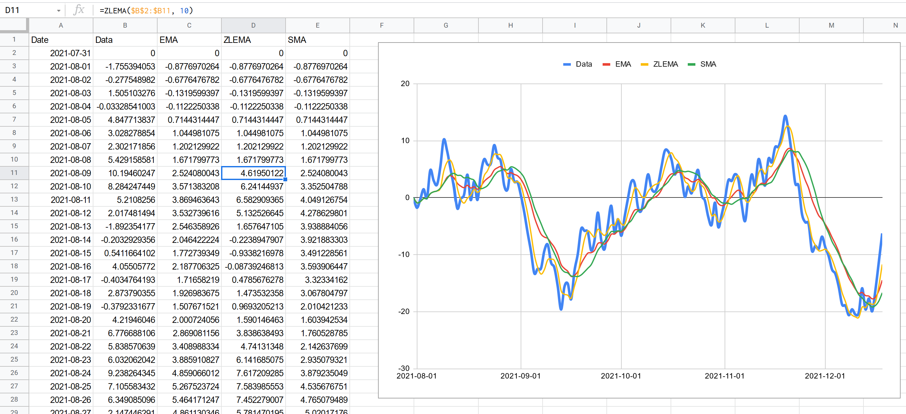

# google-apps-script-zlema

Google Apps Script to add ZLEMA (Zero Lag Exponential Moving Average) and EMA (Exponential Moving Average) functions to Google Sheets



## Usage

### Adding this script to your Google Sheet

1. On the Google Sheet document you plan to use ZLEMA or EMA, choose `Tools > Script Editor`. A new tab will appear with a blank GS file.
2. Copy and paste [the complete code](src/ZLEMA.gs) into the editor that just appeared.
3. Click on the `Save` (floppy disk) icon to save the script into your document.

### Using the ZLEMA and EMA functions

#### ZLEMA

This will compute the Zero Lag Exponential Moving Average for the input data. It will give you a single number.

```
=ZLEMA(range, period)
```

where

* `range` is range of values in A1 notation (for example, A5:A45). Currently, this only supports vertical ranges which are 1 cell wide. If the period is less than the size of the range, then an SMA for the whole range is calculated instead. Giving the whole data (from the start) up to the day you want to get the current average is highly recommended, as that is how ZLEMA works.
* `period` is the size of the data to average. The higher the period, the more smooth the average will be. The `period` should be less than the size of the `range`, else, an SMA will be computed instead.

#### EMA

This will compute the Exponential Moving Average for the input data. It will give you a single number.

```
=EMA(range, period)
```

where

* `range` is range of values in A1 notation (for example, A5:A45). Currently, this only supports vertical ranges which are 1 cell wide. If the period is less than the size of the range, then an SMA for the whole range is calculated instead. Giving the whole data (from the start) up to the day you want to get the current average is highly recommended, as that is how ZLEMA works.
* `period` is the size of the data to average. The higher the period, the more smooth the average will be. The `period` should be less than the size of the `range`, else, an SMA will be computed instead.

#### SMA

This will compute a Simple Moving Average for the whole input data. It will give you a single number.

```
=SMA(range)
```

where

* `range` is range of values in A1 notation (for example, A5:A45). Currently, this only supports vertical ranges which are 1 cell wide.

## Inspiration

I wanted to see the daily moving average of my weight as I am undergoing calorie reduction. I wanted to see something more responsive than SMA, but the best option, ZLEMA, is not available in Google Sheets, and finding code on how to compute it is very difficult, not to mention that most articles talk about ZLEMA for the purposes of the stock market or something. That's why even if I were to see a formula, I have no idea how to implement it since I'm a software engineer, not a statistician or a stock market trader. So to get it working and to help other people who may be looking for something like this, I tried to make this.

## License

Since this code looks like it is sacred and is kept secret by the "stock trading guys" if there even is such a thing, I aim to make this code very accessible to everyone, so that everyone who wants to use ZLEMA will be able to do so without looking for articles and getting frustrated with hard to understand formulas.

Contribution is very much encouraged. As long as you tested it, and it works, just send your pull request, and I will definitely accept it. Thanks for helping to make ZLEMA accessible to everyone!

```
google-apps-script-zlema - Compute ZLEMA with Google Sheets
Copyright (C) 2021  Kyle Alexander Buan

This program is free software: you can redistribute it and/or modify
it under the terms of the GNU General Public License as published by
the Free Software Foundation, either version 3 of the License, or
(at your option) any later version.

This program is distributed in the hope that it will be useful,
but WITHOUT ANY WARRANTY; without even the implied warranty of
MERCHANTABILITY or FITNESS FOR A PARTICULAR PURPOSE.  See the
GNU General Public License for more details.

You should have received a copy of the GNU General Public License
along with this program.  If not, see <https://www.gnu.org/licenses/>.
```